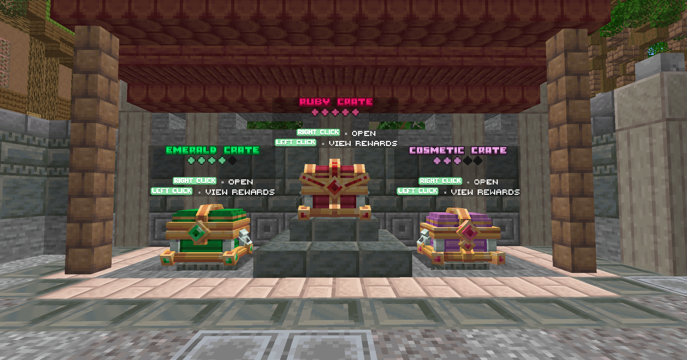

# 🎁 The Crates

To add a random aspect to your adventure, crates are available on EpicWorls. Some are available permanently while others are only ephemeral.

To open these crates, you will need to go, equipped with a key, to the <mark style="color:green;">**`/spawn`**</mark>. The boxes will then be on your right

<figure><figcaption>
<strong>Overview of the crates</strong>
</figcaption></figure>

There are different ways to obtain keys: by purchasing them in the store with Gems, by voting for the server, or by winning them in events.

## <mark style="color:green;">Voting crate</mark>

The Vote Crate key is obtained by voting for the server with the command <mark style="color:green;">**`/vote`**</mark>.

<figure><figcaption>
<strong>Vote Crates Rewards</strong>
</figcaption></figure>

\

| **Reward**                                                                                                                   | **Chance**                                   |
| ---------------------------------------------------------------------------------------------------------------------------- | -------------------------------------------- |
| <mark style="color:green;">**Adventurer's Sword**</mark>                                                                     | <mark style="color:green;">**4.08%**</mark>  |
| <mark style="color:green;">**Adventurer's Pickaxe**</mark>                                                                   | <mark style="color:green;">**4.08%**</mark>  |
| <mark style="color:green;">**Adventurer's Hoe**</mark>                                                                       | <mark style="color:green;">**4.08%**</mark>  |
| <mark style="color:green;">**Adventurer's Fishing Rod**</mark>                                                               | <mark style="color:green;">**4.08%**</mark>  |
| <mark style="color:green;">**Adventurer's Axe**</mark>                                                                       | <mark style="color:green;">**4.08%**</mark>  |
| <mark style="color:green;">**5,000 💰**</mark>                                                                               | <mark style="color:green;">**4.08%**</mark>  |
| <mark style="color:green;">**10,000 💰**</mark>                                                                              | <mark style="color:green;">**4.08%**</mark>  |
| <mark style="color:green;">**10x Gems**</mark>                                                                               | <mark style="color:green;">**4.08%**</mark>  |
| <mark style="color:green;">**Random Spawner**</mark>                                                                         | <mark style="color:green;">**4.08%**</mark>  |
| <mark style="color:green;">**Random Booster**</mark> (10%) (30m)                                                             | <mark style="color:green;">**4.08%**</mark>  |
| <mark style="color:green;">**Teleportation Stone**</mark>                                                                    | <mark style="color:green;">**4.08%**</mark>  |
| <mark style="color:green;">**EXP Random Job**</mark> (x2,000)                                                                | <mark style="color:green;">**4.08%**</mark>  |
| <mark style="color:green;">**Minecraft EXP**</mark> (x1.395)                                                                 | <mark style="color:green;">**4.08%**</mark>  |
| <mark style="color:green;">**Fly Feather**</mark> (10m)                                                                      | <mark style="color:green;">**4.08%**</mark>  |
| <mark style="color:green;">**Fly Feather**</mark> (30m)                                                                      | <mark style="color:green;">**4.08%**</mark>  |
| <mark style="color:green;">**Random Adventure Scroll**</mark>                                                                | <mark style="color:green;">**4.08%**</mark>  |
| <mark style="color:green;">**Apple Candy**</mark> (x2)                                                                       | <mark style="color:green;">**4.08%**</mark>  |
| <mark style="color:green;">**Mending Book**</mark>                                                                           | <mark style="color:green;">**4.08%**</mark>  |
| <mark style="color:green;">**Funnel**</mark>                                                                                 | <mark style="color:green;">**4.08%**</mark>  |
| <mark style="color:green;">**Netherite Fragement**</mark> (x2)                                                               | <mark style="color:green;">**4.08%**</mark>  |
| <mark style="color:green;">**Shulker Shell**</mark>                                                                          | <mark style="color:green;">**4.08%**</mark>  |
| <mark style="color:green;">**Tyro Hat**</mark>                                                                               | <mark style="color:green;">**4.08%**</mark>  |
| <mark style="color:purple;">**Cosmetic Key**</mark>                                                                          | <mark style="color:purple;">**4.08%**</mark> |
| <mark style="color:green;">**Emerald Key**</mark>                                                                            | <mark style="color:green;">**1%**</mark>     |
| <mark style="color:blue;">**Premium**</mark>[ <mark style="color:blue;">👑</mark>](https://emojipedia.org/fr/couronne) (24h) | <mark style="color:blue;">**1%**</mark>      |
| <mark style="color:red;">**Billy Rat**</mark>                                                                                | <mark style="color:red;">**0.05%**</mark>    |

## <mark style="color:green;">Cosmetic Crate</mark>

The Cosmetic Crate Key can be obtained by purchasing it in the <mark style="color:green;">**`/shop`**</mark> for 500 Gems, or by participating in events.

<figure><figcaption>
<strong>Cosmetics Crate Rewards</strong>
</figcaption></figure>

| **Reward**                                                       | **Chance**                                   |
| ---------------------------------------------------------------- | -------------------------------------------- |
| <mark style="color:green;">**Egg Stick**</mark>                  | <mark style="color:green;">**5.55%**</mark>  |
| <mark style="color:green;">**Carton**</mark>                     | <mark style="color:green;">**5.55%**</mark>  |
| <mark style="color:green;">**Straw Hat**</mark>                  | <mark style="color:green;">**5.55%**</mark>  |
| <mark style="color:yellow;">**Chicken wings**</mark>             | <mark style="color:yellow;">**5.55%**</mark> |
| <mark style="color:yellow;">**Pirate Hat**</mark>                | <mark style="color:yellow;">**5.55%**</mark> |
| <mark style="color:yellow;">**Chicken Hat**</mark>               | <mark style="color:yellow;">**5.55%**</mark> |
| <mark style="color:yellow;">**Treasure Chest**</mark>            | <mark style="color:yellow;">**5.55%**</mark> |
| <mark style="color:yellow;">**Cutlass**</mark>                   | <mark style="color:yellow;">**5.55%**</mark> |
| <mark style="color:blue;">**Frost Shield**</mark>                | <mark style="color:blue;">**5.55%**</mark>   |
| <mark style="color:blue;">**Medusa Hat**</mark>                  | <mark style="color:blue;">**5.55%**</mark>   |
| <mark style="color:blue;">**Frosted Sword**</mark>               | <mark style="color:blue;">**5.55%**</mark>   |
| <mark style="color:blue;">**Cybernetic Blade**</mark>            | <mark style="color:blue;">**5.55%**</mark>   |
| <mark style="color:blue;">**Krampus Tail**</mark>                | <mark style="color:blue;">**5.55%**</mark>   |
| <mark style="color:blue;">**Cybernetic Backpack Reactor**</mark> | <mark style="color:blue;">**5.55%**</mark>   |
| <mark style="color:purple;">**Ghost King Shield**</mark>         | <mark style="color:purple;">**5.55%**</mark> |
| <mark style="color:purple;">**Ghost King Crown**</mark>          | <mark style="color:purple;">**5.55%**</mark> |
| <mark style="color:purple;">**Shadow Dragon Claws**</mark>       | <mark style="color:purple;">**5.55%**</mark> |
| <mark style="color:purple;">**Cuckoo House**</mark>              | <mark style="color:purple;">**5.55%**</mark> |

## <mark style="color:green;">Emerald Crate</mark>

The Emerald Crate key can be obtained by purchasing it in the <mark style="color:green;">**`/shop`**</mark>for 500 Gems, or by participating in events.

<figure><figcaption>
Emerald <strong>Crate Rewards</strong>
</figcaption></figure>

| <mark style="color:green;">**Emerald Sword**</mark>                 | <mark style="color:green;">**5.55%**</mark>  |
| ------------------------------------------------------------------- | -------------------------------------------- |
| <mark style="color:green;">**Emerald Pickaxe**</mark>               | <mark style="color:green;">**5.55%**</mark>  |
| <mark style="color:green;">**Emerald Axe**</mark>                   | <mark style="color:green;">**5.55%**</mark>  |
| <mark style="color:green;">**Emerald Hoe**</mark>                   | <mark style="color:green;">**5.55%**</mark>  |
| <mark style="color:green;">**Emerald Fishing Rod**</mark>           | <mark style="color:green;">**5.55%**</mark>  |
| <mark style="color:green;">**Emerald Shovel**</mark>                | <mark style="color:green;">**5.55%**</mark>  |
| <mark style="color:green;">**Emerald Scepter**</mark>               | <mark style="color:green;">**5.55%**</mark>  |
| <mark style="color:green;">**Familiar Egg**</mark>                  | <mark style="color:green;">**5.55%**</mark>  |
| <mark style="color:green;">**300,000 💰**</mark>                    | <mark style="color:green;">**5.55%**</mark>  |
| <mark style="color:green;">**Random Spawner**</mark>                | <mark style="color:green;">**5.55%**</mark>  |
| <mark style="color:green;">**Random Booster**</mark> (25%) (1h)     | <mark style="color:green;">**5.55%**</mark>  |
| <mark style="color:yellow;">**Random Class Card**</mark>            | <mark style="color:yellow;">**5.55%**</mark> |
| <mark style="color:yellow;">**Teleportation Stone**</mark>          | <mark style="color:yellow;">**5.55%**</mark> |
| <mark style="color:blue;">**Hard Adventure Scrol**</mark>**l** (x3) | <mark style="color:blue;">**5.55%**</mark>   |
| <mark style="color:blue;">**Blueberry Candy**</mark> (x3)           | <mark style="color:blue;">**5.55%**</mark>   |
| <mark style="color:green;">**Emerald Key**</mark> (x2)              | <mark style="color:green;">**5.55%**</mark>  |
| <mark style="color:red;">**Ruby Key**</mark>                        | <mark style="color:red;">**5.55%**</mark>    |
| <mark style="color:yellow;">**Totem of Immortality**</mark>         | <mark style="color:yellow;">**5.55%**</mark> |

## <mark style="color:red;">Ruby Crate</mark>

The Ruby Crate Key can be obtained by purchasing it in the <mark style="color:green;">**`/shop`**</mark>for 950 Gems.

<figure><figcaption>
<strong>Récompense de la Caisse Rubis</strong>
</figcaption></figure>

| <mark style="color:red;">**Ruby Sword**</mark>                                                           | <mark style="color:red;">**5.82%**</mark>    |
| -------------------------------------------------------------------------------------------------------- | -------------------------------------------- |
| <mark style="color:red;">**Ruby Pickaxe**</mark>                                                         | <mark style="color:red;">**5.82%**</mark>    |
| <mark style="color:red;">**Ruby Axe**</mark>                                                             | <mark style="color:red;">**5.82%**</mark>    |
| <mark style="color:red;">**Ruby Hoe**</mark>                                                             | <mark style="color:red;">**5.82%**</mark>    |
| <mark style="color:red;">**Ruby Fishing Rod**</mark>                                                     | <mark style="color:red;">**5.82%**</mark>    |
| <mark style="color:red;">**Ruby Shovel**</mark>                                                          | <mark style="color:red;">**5.82%**</mark>    |
| <mark style="color:red;">**Ruby Hammer**</mark>                                                          | <mark style="color:red;">**5.82%**</mark>    |
| <mark style="color:red;">**Familiar Egg**</mark>                                                         | <mark style="color:red;">**5.82%**</mark>    |
| <mark style="color:red;">**Ruby Chest**</mark>                                                           | <mark style="color:red;">**5.82%**</mark>    |
| <mark style="color:red;">**800,000 💰**</mark>                                                           | <mark style="color:red;">**5.82%**</mark>    |
| <mark style="color:red;">**Random Spawner**</mark>                                                       | <mark style="color:red;">**5.82%**</mark>    |
| <mark style="color:red;">**Random Booster**</mark> (50%) (1h)                                            | <mark style="color:red;">**5.82%**</mark>    |
| <mark style="color:blue;">**Random Class Cards**</mark>                                                  | <mark style="color:blue;">**5.82%**</mark>   |
| <mark style="color:blue;">**Teleportation Stone**</mark>                                                 | <mark style="color:blue;">**5.82%**</mark>   |
| <mark style="color:purple;">**Expert Adventure Scroll**</mark> (x3)                                      | <mark style="color:purple;">**5.82%**</mark> |
| <mark style="color:purple;">**Grape Candy**</mark> (x3)                                                  | <mark style="color:purple;">**5.82%**</mark> |
| <mark style="color:red;">**Ruby Key**</mark> (x2)                                                        | <mark style="color:red;">**5.82%**</mark>    |
| <mark style="color:yellow;">**Hero**</mark>**&#x20;**<mark style="color:red;">**Grade**</mark> (Version) | <mark style="color:red;">**1%**</mark>       |


Try your luck and open crates on EpicWorld !

